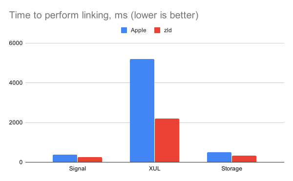

# zld
## A faster version of Apple's linker

### As used by

Most of the really big third-party apps out there.

### Introduction

For large projects, the linking phase ([explanation](https://stackoverflow.com/questions/6264249/how-does-the-compilation-linking-process-work)) can significantly increase incremental build times. This project is a fork of the Apple linker, `ld`. It is a drop-in replacement that can substantially speed things up.

***Note***: it is only intended for debug builds, to make debugging faster.

### Performance



Feel free to file an issue if you find that linking is not at least 40% faster for your case (make sure to run it twice in a row to ensure that [caches](#caching) have been generated). Further benchmark details can be found [here](misc/benchmarks.md).

### Is it worth it for my project?

It all depends on your risk tolerance and how much you value the speedup in incremental build time. When linking takes more than one second, I'd cut that time in half as the estimated time with this new linker. If that difference is compelling to you, then it'd be worth trying out. Personally, I'd use it in projects with an existing link time of even 500ms (but I am an impatient tinkerer).

### Stability

`zld` is forked from the most recently open-sourced version of `ld`. It's used by thousands of developers across many of the largest apps in the world. Without a few optimizations around hashing, it would produce byte-for-byte the same executables as the open-source one. Although it's not ideal to mix compiler and linker toolchain versions, the open-source one is fairly recent. `zld` will continue to be updated with each new version of `ld` as it is released.

### Installation

Below are the installation methods. Note that, if you someday install a newer version of Xcode and zld doesn't work with it, it may be that your version of zld is now too far behind that of the linker shipped in Xcode. In that case, check back here for the latest zld release to fix the problem.

#### Pre-built binary

The pre-built binary for the latest release is [here](https://github.com/michaeleisel/zld/releases/latest).

#### Building from source (only supported for non-ARM macs)

- Install Xcode 12.2+ and run `sudo xcode-select -s <path to Xcode>`
- Install cmake
- Checkout the [latest release of zld](https://github.com/michaeleisel/zld/releases/latest) from master
- Run `make clean && make`
- See in the output where it built zld (probably `build/Build/Products/Release/zld`).

### Usage

#### If using Xcode:
Get the path of zld from `which zld`, then add `-fuse-ld=<path to zld> -Wl,-zld_original_ld_path,$(DT_TOOLCHAIN_DIR)/usr/bin/ld` to "Other Linker Flags" in the build settings (debug configuration). That `-zld_original_ld_path` provides the path to the linker Xcode would otherwise use, which is important because there are certain known cases (e.g. arm64_32 and Catalyst) where zld knows that it has issues and will silently use that linker instead. Fixing these cases is a work-in-progress (largely blocked by Apple being slow to release source code).

#### If using Bazel:

Add these to your `.bazelrc` or pass them to your command line.

```
build --linkopt=-fuse-ld=<path to zld>
build --linkopt=-Wl,-zld_original_ld_path,__BAZEL_XCODE_DEVELOPER_DIR__/Toolchains/XcodeDefault.xctoolchain/usr/bin/ld
```

Note that you will need to disable sandbox for this to work now. Additionally, to make the linking actions cacheable, the path to zld must be deterministic (e.g. `/tmp/zld-09ea158`, where `09ea158` is zld version).

#### If using Rust:

You can edit `~/.cargo/config` to add a linker flag, e.g.:

```
[target.x86_64-apple-darwin]

rustflags = ["-C", "link-arg=-fuse-ld=<path to zld>"]
```

### Caching

By default, `zld` stores some metadata in `/tmp/zld-...` to speed things up. This is the first step towards making `zld` a truly incremental linker. Currently, the only things that are stored are object file and library names.

### Why is it faster?

Apple's approach is a very reasonable one, using C++ with STL data structures. However, there are a number of ways in which `zld` has sped things up, for instance:

- Using [Swiss Tables](https://abseil.io/blog/20180927-swisstables) instead of STL for hash maps and sets
- Parallelizing in various places (the parsing of libraries, writing the output file, sorting, etc.)
- Optimizations around the hashing of strings (caching the hashes, using a better hash function, etc.)

### Other things to speed up linking

Whether you use this project or not, there are a number of things that can speed linking up (again, this is only for debug builds):

- The linker flag `-Wl,-random_uuid`, which disables content hashing based UUID creation and instead uses a random UUID (using `-no_uuid` can decrease performance when lldb is attaching to the binary)
- Turning off dead stripping (referred to as "Dead Code Stripping" in Xcode build settings)
- For executables and xctest bundles, disable dyld exports trie creation with `-Wl,-exported_symbols_list,/dev/null` (cannot be used by test host apps that provide symbols to xctests)
- `-Wl,-no_deduplicate`, which disables the deduplication pass. In Xcode, this flag is added by default for Debug builds.
- `-Wl,-no_compact_unwind`, which disables the creation of compact unwind info. Note that Objective-C and C++ functions that have been linked without their compact unwind info can crash if an exception unwinds into them, rather than continuing the unwind. Swift functions, however, are not affected (even if an Objective-C/C++ exception unwinds into them). So, it's best for pure Swift projects. It can also break crash reporting.
- `-Wl,-x`, which disables putting non-global symbols in the symbol table. This won't impact debugging as long as debug info is still enabled.
- If you're not using `zld`, using `-Wl,-force_load` for libraries can sometimes speed things up
- Linking with dynamic libraries instead of static ones

### Contributing

The biggest way to contribute to `zld` is to file issues! If you encountered any problems, feel free to file an issue, and you can expect a prompt response.

Special thanks to @dmaclach's [ld64](https://github.com/dmaclach/ld64), which helped with building `ld`.
