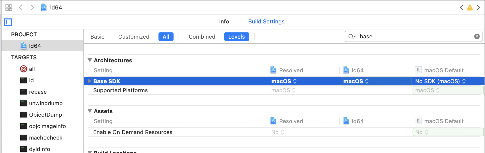
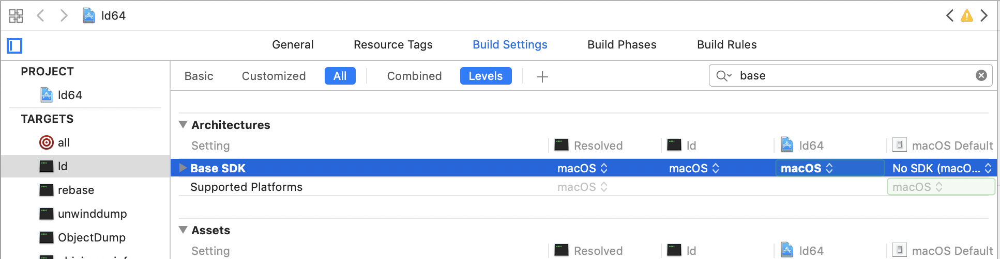
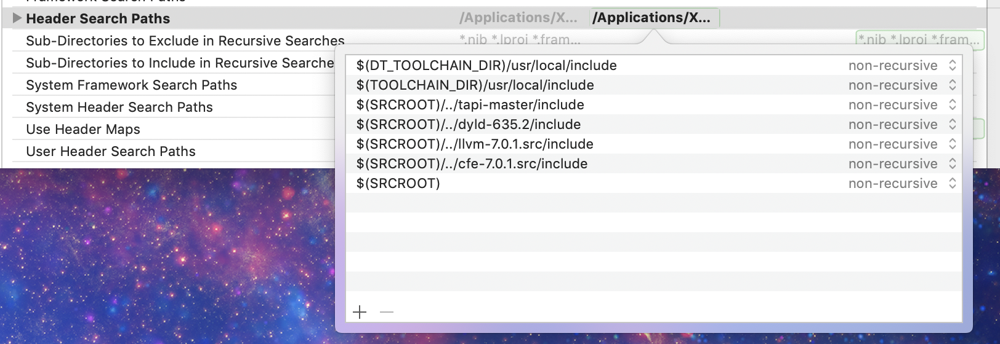
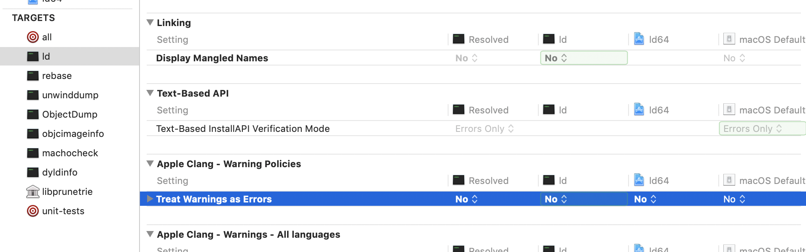

# ld64

These instructions are for building ld64 based on Apple's sources for the ld64 that comes
with Xcode 10.1 and the dyld from Mojave (10.14.1) with clang/llvm 7.0.1. This seems 

1. Initial setup
  1. Install Xcode 10.1 from [Apple](https://developer.apple.com/download/)
  1. Clone this project, or download the zip.
  1. Navigate to the project directory in the terminal.
  1. Make sure there are no spaces in the current directory path, or things will go badly for you.
1. Get Sources
  1.  `curl https://opensource.apple.com/tarballs/ld64/ld64-409.12.tar.gz --output ld64-409.12.tar.gz`
  1.  `curl https://opensource.apple.com/tarballs/dyld/dyld-635.2.tar.gz --output dyld-635.2.tar.gz`
  1.  `curl https://codeload.github.com/ributzka/tapi/zip/master --output tapi.zip`
  1.  `curl http://releases.llvm.org/7.0.1/llvm-7.0.1.src.tar.xz --output llvm-7.0.1.src.tar.xz`
  1.  `curl http://releases.llvm.org/7.0.1/cfe-7.0.1.src.tar.xz --output cfe-7.0.1.src.tar.xz`
  1.  `open ld64-409.12.tar.gz`
  1.  `open dyld-635.2.tar.gz`
  1.  `open tapi.zip`
  1.  `open llvm-7.0.1.src.tar.xz`
  1.  `open cfe-7.0.1.src.tar.xz`
1. Apply patches
  1. `cd tapi-master`
  1. `patch -p1 < ../patches/tapi.patch`
  1. `cd ..`
  1. `cd ld64-409.12`
  1. `patch -p1 < ../patches/ld64.patch`
  1. `cd ..`
  1. `cd dyld-635.2`
  1. `patch -p1 < ../patches/dyld.patch` 
  1. `cd ..`
1. Configure ld64 project
  1. `open ld64-409.12/ld64.xcodeproj`
  1. Change the `Base SDK` for the ld64 project from `macosx.internal` to `macos`
    
  1. Remove the override for `Base SDK` from the ld target so it changes from `macosx.internal` to `macos` (you can do this be selecting it and hitting delete).
    
  1. Add the following `Header Search Paths`:
     * `$(SRCROOT)/../tapi-master/include`
     * `$(SRCROOT)/../dyld-635.2/include`
     * `$(SRCROOT)/../llvm-7.0.1.src/include`
     * `$(SRCROOT)/../cfe-7.0.1.src/include`
     
  1. Set `Treat Warnings as Errors` to `No`
  
  1. Select the `ld` target to build
  1. `Build`

You should be able to replace the ld64 that comes with Xcode 10.1 with this one (located in `/Applications/Xcode.app/Contents/Developer/Toolchains/XcodeDefault.xctoolchain/usr/bin/`). It will successfully link macOS 10.14, iOS 12 apps.

**Be sure to back up your original `ld64`!!!**

**Do not ship anything to Apple that was linked with this linker. This is purely for debugging linker related issues.**

## Level of support
This is not an officially supported Google product.
