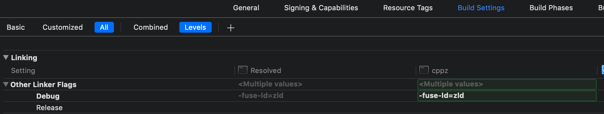

# zld
## A faster version of Apple's linker

### Introduction

For large projects, the linking phase ([explanation](https://stackoverflow.com/questions/6264249/how-does-the-compilation-linking-process-work)) can significantly increase incremental build times. This project is a fork of the Apple linker, `ld`. It is a drop-in replacement that can substantially speed things up.

***Note***: it is only intended for debug builds, to make debugging faster.

### Performance


Feel free to file an issue if you find it's not at least 40% faster for your case (make sure to run it twice in a row to ensure that [caches](#caching) have been generated). Further benchmark details can be found [here](misc/benchmarks.md).

### Is it worth it for my project?

It all depends on your risk tolerance and how much you value the speedup in incremental build time. When linking takes more than one second, I'd cut that time in half as the estimated time with this new linker. If that difference is compelling to you, then it'd be worth trying out. Personally, I'd use it in projects with an existing link time of even 500ms (but I am an impatient tinkerer).

### Stability

`zld` is forked from the most recently open-sourced version of `ld`. Without a few optimizations around hashing, it would produce byte-for-byte the same executables as the open-source one. Although it's not ideal to mix compiler and linker toolchain versions, and the open-source one is a bit old (Xcode 10.2, v450.3), this has been tested to work on Swift 5 projects. There's no obvious reason why it shouldn't. The linker, after all, is fairly language-agnostic. `zld` will be updated with more recent versions of the linker as Apple open-sources them.

### Installation

```
brew install michaeleisel/zld/zld
```

### Usage

If using Xcode, get the path of zld from `which zld`, then add `-fuse-ld=<path to zld>` to "Other Linker Flags" in the build settings (debug configuration):



If using Rust, you can edit `~/.cargo/config` to add a linker flag, e.g.:

```
[target.x86_64-apple-darwin]

rustflags = ["-C", "link-arg=-fuse-ld=<path to zld>"]
```

### Caching

By default, `zld` stores some metadata in `/tmp/zld-...` to speed things up. This is the first step towards making `zld` a truly incremental linker. Currently, the only things that are stored are object file and library names.

### Why is it faster?

Apple's approach is a very reasonable one, using C++ with STL data structures. However, there are a number of ways in which `zld` has sped things up, for instance:

- Using [Swiss Tables](https://abseil.io/blog/20180927-swisstables) instead of STL for hash maps and sets
- Parallelizing in various places (the parsing of libraries, writing the output file, sorting, etc.)
- Optimizations around the hashing of strings (caching the hashes, using a better hash function, etc.)

### Other things to speed up linking

Whether you use this project or not, there are a number of things that can speed linking up (again, this is only for debug builds):

- The linker flag `-Wl,-no_uuid`, which disables UUID creation
- Turning off dead stripping (referred to as "Dead Code Stripping" in Xcode build settings)
- If you're not using `zld`, using `-Wl,-force_load` for libraries can sometimes speed things up
- Linking with dynamic libraries instead of static ones

### Contributing

The biggest way to contribute to `zld` is to file issues! If you encountered any problems, feel free to file an issue, and you can expect a prompt response.

Special thanks to @dmaclach's [ld64](https://github.com/dmaclach/ld64), which helped with building `ld`.
